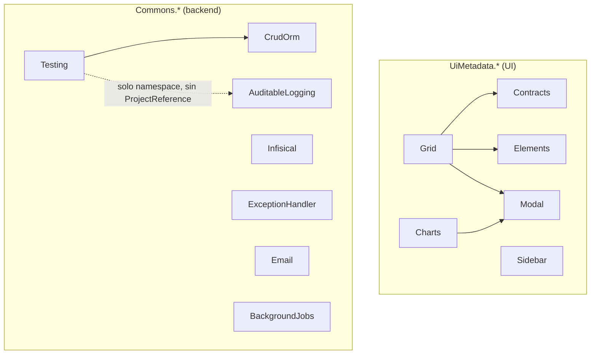

# Corebound Labs — Documentación de paquetes

Documentación de los paquetes reutilizables (`Commons.*`/`UiMetadata.*`)
usados por los proyectos de Corebound Labs — hoy, principalmente EcoTrack.

Este sitio documenta **los paquetes**, no las apps que los consumen. Para
lógica de negocio de EcoTrack (controllers, Handlers), ver el repo de
EcoTrack directamente.

## Empezar

- **Paquetes `Commons.*`** — lógica de backend pura, sin UI: [CrudOrm](packages/commons-crudorm.md), [Infisical](packages/commons-infisical.md), [AuditableLogging](packages/commons-auditablelogging.md), [ExceptionHandler](packages/commons-exceptionhandler.md), [Email](packages/commons-email.md), [Testing](packages/commons-testing.md), [BackgroundJobs](packages/commons-backgroundjobs.md).
- **Paquetes `UiMetadata.*`** — Razor Class Libraries de UI: [Contracts](packages/uimetadata-contracts.md), [Grid](packages/uimetadata-grid.md), [Modal](packages/uimetadata-modal.md), [Elements](packages/uimetadata-elements.md), [Sidebar](packages/uimetadata-sidebar.md), [Charts](packages/uimetadata-charts.md).

## Mapa de dependencias

Sin flecha entrante = paquete base, sin dependencias de otro `Commons.*`/
`UiMetadata.*` de este catálogo (`Contracts`, `Elements`, `Modal`,
`Sidebar`, `CrudOrm`, `Infisical`, `ExceptionHandler`, `Email`,
`BackgroundJobs`). Click en cualquier nodo para ir a su página.

## Cómo está organizado este sitio

Cada página de paquete consolida el contenido real de su propio
`README.md` (dentro del repo del paquete) — este sitio no inventa
contenido nuevo, solo lo presenta con navegación, búsqueda y resaltado de
sintaxis. Si algo acá queda desactualizado respecto al código, el
`README.md` del paquete es la fuente de verdad.
