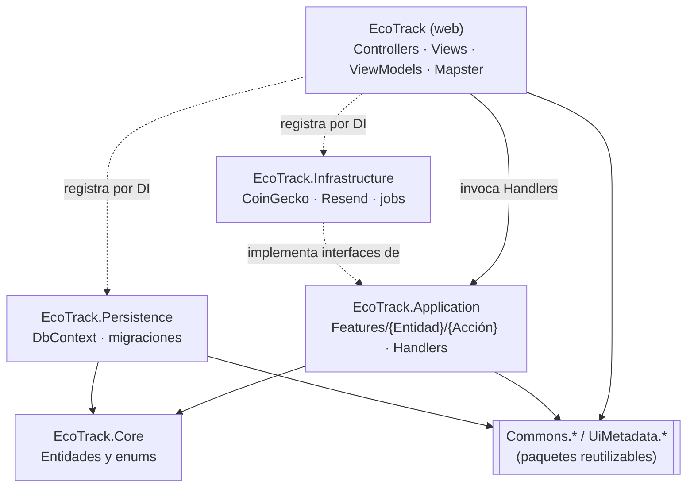
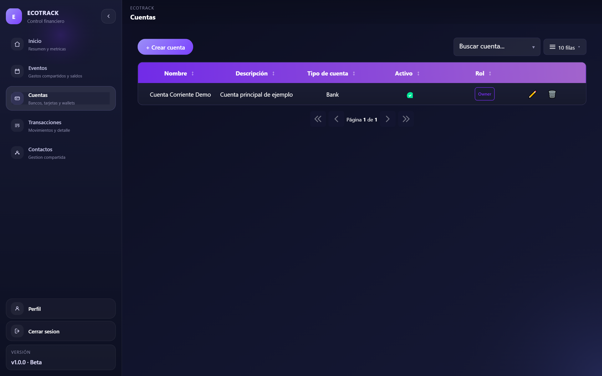
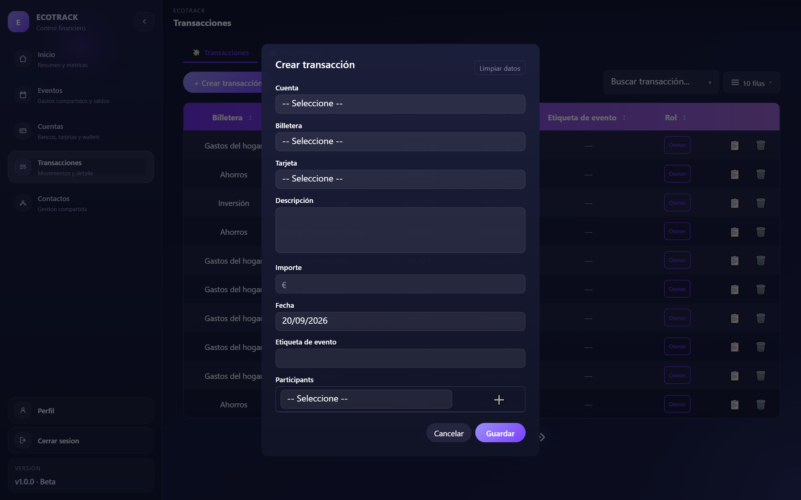

# 🏠 Proyecto EcoTrack

> Esta sección documenta **la aplicación EcoTrack**, no las librerías.
> Para las librerías reutilizables ver la pestaña [📦 Paquetes](/packages/).

EcoTrack es una aplicación web de gestión financiera personal **y compartida**:
cuentas, tarjetas, wallets y transacciones, con acceso compartido entre personas
mediante permisos y titularidad granulares. ASP.NET Core MVC (.NET 10), capas +
Vertical Slice.

Para arquitectura, modelo de dominio, puesta en marcha y flujo de ramas, el
documento de referencia es el `README.md` del repo de EcoTrack. Aquí viven las
**guías transversales** de la aplicación.

## Arquitectura de un vistazo

Capas más Vertical Slice dentro de Application: cada acción de negocio es un slice
(`Command`/`Query` + `Handler`) que se resuelve por DI, sin MediatR.

Una petición típica: `Controller → Handler → ICommonRepository → DbContext → SQL Server`.

## Pantallas

Capturas de EcoTrack con **datos de prueba** inventados (una cuenta demo, cuatro wallets, dos tarjetas con
dígitos ficticios y 30 transacciones).

| | |
|---|---|
|  |  |
| **Dashboard** — KPIs y gráficos ([Charts](/packages/uimetadata-charts.md)) | **Cuentas** — grilla ([Grid](/packages/uimetadata-grid.md)) |
|  |  |
| **Detalle de cuenta** — subgrillas de wallets y tarjetas | **Transacciones** — importes con color y paginación |
|  |  |
| **Modal de alta** generado por reflection ([Modal](/packages/uimetadata-modal.md)) | **Modal de transacción** con selects en cascada |

La barra lateral de todas las capturas es [UiMetadata.Sidebar](/packages/uimetadata-sidebar.md).

## Guías

- [Seguridad](/ecotrack/security.md)
- [Roles, planes y panel admin](/ecotrack/roles-plans-admin.md)
- [Verificación en dos pasos](/ecotrack/two-factor-authentication.md)
- [Importación de transacciones](/ecotrack/importing-transactions.md)
- [Añadir un tema](/ecotrack/adding-a-theme.md)
- [Operación y despliegue](/ecotrack/operations.md)

## Relación con los paquetes

EcoTrack **consume** los paquetes `Commons.*` / `UiMetadata.*`; los paquetes no
conocen a EcoTrack. Qué paquete se usa dónde y con qué configuración está en
[Qué paquetes usa EcoTrack](/ecotrack/uso-de-paquetes.md).
