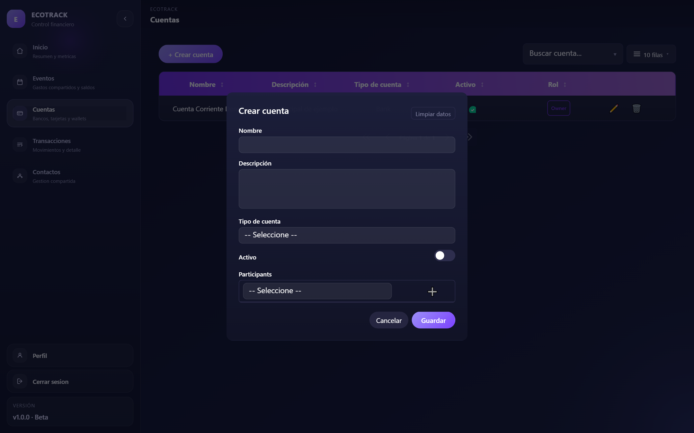
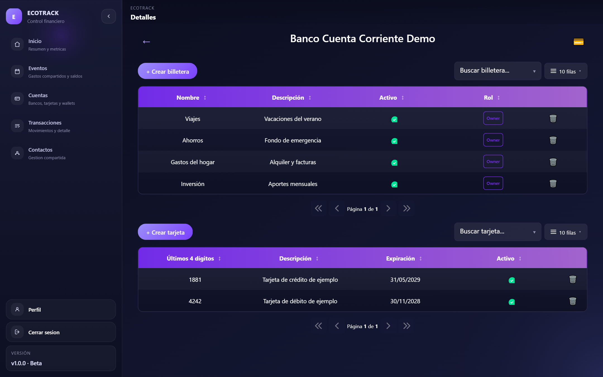
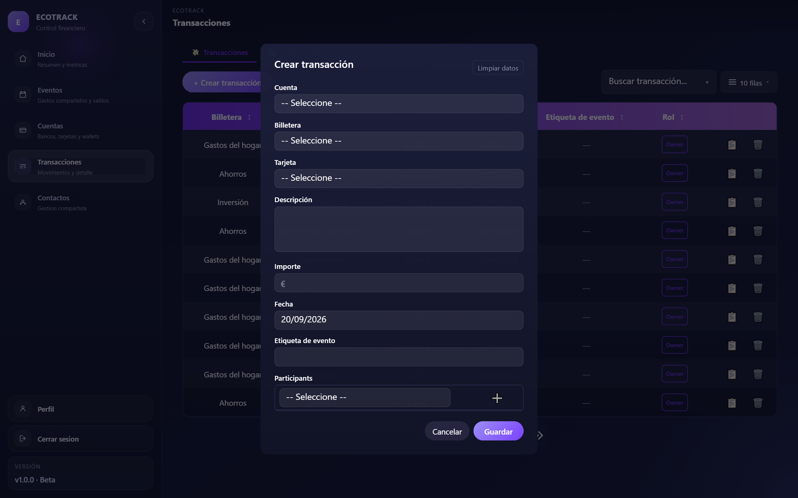

# Primeros pasos: cuentas, billeteras, tarjetas y transacciones

Cómo dar de alta lo básico del día a día: cuentas, sus billeteras y tarjetas, y las
transacciones. Para seguridad, roles/planes, 2FA, importar/exportar o notificaciones
ver sus propias guías; para contactos y gastos compartidos con otras personas ver
[Contactos y gastos compartidos](shared-expenses.md).

## Cuentas

**Cuentas → + Crear cuenta.**

- **Nombre** y **Descripción**: obligatorios.
- **Tipo de cuenta**: `Banco`, `Cripto`, `Efectivo` o `Prepago`. Según cuál elijas
  aparecen campos propios de ese tipo:
  - **Cripto** → Dirección de wallet y Red/Chain (ej. Bitcoin, Ethereum, Polygon).
  - **Prepago** → Identificador de cuenta (ej. el email de PayPal).
  - **Banco** y **Efectivo** no tienen campos extra. Una cuenta **Efectivo** tampoco
    muestra la sección de tarjetas en su detalle (no aplican).
- **Activo**: para desactivar una cuenta sin borrarla.
- **Participants**: opcional, para compartir la cuenta con alguien de tus
  [Contactos](shared-expenses.md#contactos) desde el mismo alta — se explica en
  [Compartir una cuenta o billetera](shared-expenses.md#compartir-una-cuenta-o-billetera).

En el listado, cada fila muestra tu **Rol** sobre esa cuenta (`Owner` si es tuya,
o el permiso que te dieron si es compartida). Solo el dueño real puede eliminarla;
un cotitular ve en cambio un botón para salir de la cuenta compartida.

## Billeteras y tarjetas

Al hacer clic en una cuenta del listado entrás a su **Detalle**, con las billeteras
y tarjetas de esa cuenta:

- **+ Crear billetera**: Nombre, Descripción, **Divisa** (EUR, USD, ARS, ETH o BTC)
  y Activo. Toda transacción se hace siempre contra una billetera, nunca
  directamente contra la cuenta.
- **+ Crear tarjeta** (no disponible en cuentas Efectivo): Últimos 4 dígitos,
  Descripción, fecha de **Expiración** y Activo; opcionalmente podés asociarla a
  una billetera concreta. Una tarjeta solo la ve quien la creó, aunque la cuenta
  sea compartida.
- Las billeteras también se pueden compartir con un contacto (mismo mecanismo que
  las cuentas) — ver [Compartir una cuenta o billetera](shared-expenses.md#compartir-una-cuenta-o-billetera).

## Transacciones

**Transacciones → + Crear transacción** (o el botón 💳 dentro del detalle de una
cuenta, que abre el mismo modal con la cuenta ya elegida).

- **Cuenta** y **Billetera**: obligatorio elegir la billetera; la cuenta ayuda a
  filtrar cuál.
- **Tarjeta**: opcional, solo si el tipo de transacción es el normal.
- **Descripción**: obligatoria.
- **Importe**: **positivo para un ingreso, negativo para un gasto** (el signo se
  ve luego con color en el listado).
- **Fecha**.
- **Etiqueta de evento**: texto libre y opcional (ej. "Viaje a la playa") para
  agrupar gastos compartidos — ver [Gastos compartidos por evento](shared-expenses.md#gastos-compartidos-por-evento).
- **Participants**: opcional, para repartir esa transacción puntual con otras
  personas — también en la guía de gastos compartidos.

Una vez creada, una transacción **no se puede mover** de cuenta ni de billetera
(sí se puede editar el resto).

### Tipo de transacción
El campo **Tipo** decide qué hace el modal, y por defecto es "Normal":
- **Normal**: alta de siempre, la de arriba.
- **Transferencia entre mis cuentas**: mueve saldo entre dos billeteras **tuyas**
  (elegís la billetera de destino); se generan dos movimientos enlazados.
- **Envío a otra persona**: no es un alta de transacción — te lleva directamente a
  **Eventos**, porque es el mismo mecanismo para saldar deudas con un contacto (ver
  [Gastos compartidos por evento](shared-expenses.md#gastos-compartidos-por-evento)).

### Transacciones programadas
En la pestaña **Programadas** de Transacciones podés dejar movimientos que se
generan solos (alquiler, suscripciones…): Billetera, una **expresión cron** de 5
campos (con ejemplo en el propio formulario: `0 9 * * 2` = todos los martes a las
9am), Fecha de inicio, cuándo **Finaliza** (indefinida, hasta una fecha o hasta un
número máximo de repeticiones) e Importe/Descripción/Etiqueta de evento por
defecto para cada ocurrencia generada.
