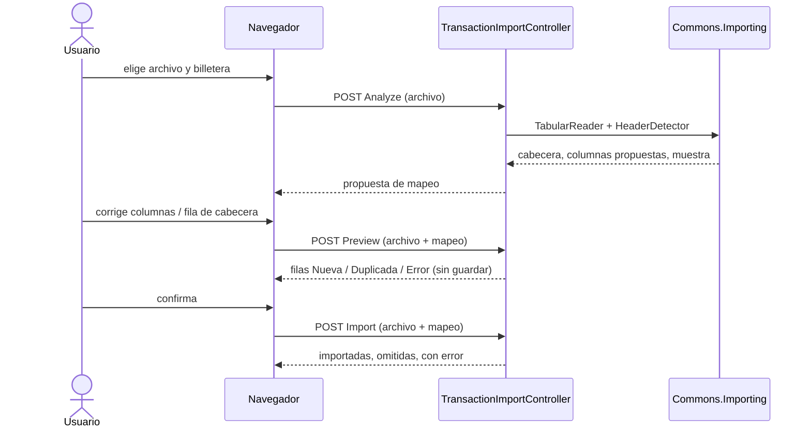

# Importación de transacciones

Importar los movimientos de un extracto bancario (CSV, XLS o XLSX) a una billetera, desde **Transacciones →
Importar archivo**. No usa IA: la lectura y la detección de columnas son reglas
([Commons.Importing](../packages/commons-importing.md)) y el usuario puede corregir todo lo que no acierte.

## Flujo del usuario (asistente de 4 pasos)
1. **Archivo y billetera:** elige el archivo (máx. 2 MB) y la billetera de destino (solo las que puede editar). Hay una
   **plantilla CSV descargable** (`/templates/plantilla-importacion.csv`) para bancos que no se lean bien.
2. **Columnas:** se detecta la fila de cabecera (los bancos ponen títulos, titular o IBAN encima) y el papel de cada
   columna. El usuario puede **elegir otra fila de cabecera**, asignar cada columna (fecha, concepto, importe con signo, cargo,
   abono, saldo, ignorar) y el orden de la fecha (día/mes o mes/día). Opción **omitir duplicados** (activa por defecto).
3. **Vista previa:** cada fila queda como *Nueva*, *Duplicada* o *Error* (con el motivo), con los totales de ingresos y
   gastos. Nada se guarda todavía.
4. **Resultado:** importadas, omitidas por duplicadas, con error y las que fallaron al guardar (con su fila).

## Diagrama del flujo

El navegador reenvía el archivo en cada paso: el servidor no guarda estado.

## Cómo funciona (backend)
Sin estado en el servidor: el navegador conserva el archivo y lo **reenvía en cada paso**, así no hay nada que caducar ni
limpiar. Endpoints de `TransactionImportController` (todos `[Authorize]`, con el token CSRF de siempre):

| Endpoint | Qué hace |
|---|---|
| `GET Options` | billeteras donde puede crear (mismo criterio que el alta manual) y tope de filas del plan |
| `POST Analyze` | lee el archivo y devuelve cabecera, columnas propuestas y una muestra; con `headerRow` recalcula para otra fila |
| `POST Preview` | interpreta con el mapeo elegido y clasifica cada fila (sin guardar) |
| `POST Import` | igual que Preview y guarda |

La lógica vive en `Features/Transactions/ImportTransactions` (`ImportFileService`, `ImportTransactionsHandler`).

## Reglas
- **Se guarda con `SaveTransactionHandler`**, igual que una transacción manual: reparto entre participantes, pagador y
  permisos se calculan como siempre. Las filas van con importe **con signo** (negativo = gasto).
- **No consume el cupo diario de transacciones** ni lo anota: la importación tiene su propio tope,
  `Plan.MaxImportRows` (Basic 200 filas por archivo, Complimentary sin tope propio). Si el archivo trae más filas válidas que
  el tope, no se importa nada (la vista previa lo avisa). Tope técnico para todos: 5000 filas y 2 MB.
- **Duplicados:** una fila es duplicada si en esa billetera ya hay una transacción con la **misma fecha, importe y
  concepto normalizado** (sin números de tarjeta, referencias ni fechas dentro del texto). Se compara como
  multiconjunto: dos cafés idénticos el mismo día son legítimos, y solo se descartan tantos como ya existan.
- **Errores por fila:** una fila mala (fecha o importe no válidos, concepto vacío) se informa y no detiene al resto. Un error
  de negocio al guardar una fila también se informa y se sigue.
- **Permisos:** hace falta permiso de edición en la billetera y que la cuenta no esté cerrada, comprobado en servidor.
- **Seguridad:** el contenido del archivo es no confiable; el asistente lo pinta siempre con `textContent`. Al reexportar
  a Excel habría que neutralizar fórmulas.

## Pendiente
- Asignar **tarjeta** a lo importado (hoy va sin tarjeta) y **categorización por reglas** (ver la propuesta de fase 2).
- Perfiles de mapeo guardados por banco, para no repetir el paso 2.
- Probarlo con extractos reales de cada banco.
- Importar filas de una en una hace varias consultas por fila: con 5000 filas será lento; si hace falta, optimizarlo por lotes.

Migración: `AddPlanMaxImportRows` (columna `Plans.MaxImportRows`; ver [Roles, planes y panel admin](roles-plans-admin.md)).
