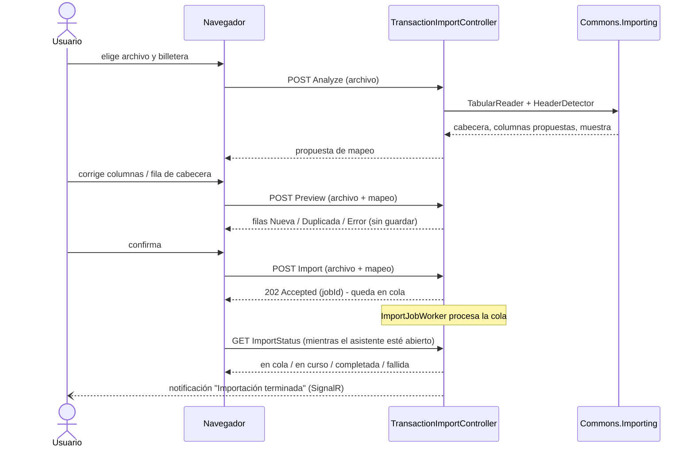

# Importación de transacciones

Importar los movimientos de un extracto bancario (CSV, XLS o XLSX) a una billetera, desde **Transacciones →
Importar archivo**. No usa IA: la lectura y la detección de columnas son reglas
([Commons.Importing](../packages/commons-importing.md)) y el usuario puede corregir todo lo que no acierte.

## Flujo del usuario (asistente de 4 pasos)
1. **Archivo y billetera:** arrastra el archivo a la zona de carga (o haz clic para elegirlo; máx. 2 MB) y la billetera de destino (solo las que puede editar). Hay una
   **plantilla CSV descargable** (`/templates/plantilla-importacion.csv`) para bancos que no se lean bien.
2. **Columnas:** se detecta la fila de cabecera (los bancos ponen títulos, titular o IBAN encima) y el papel de cada
   columna. El usuario puede **elegir otra fila de cabecera**, asignar cada columna (fecha, concepto, importe con signo, cargo,
   abono, saldo, ignorar) y el orden de la fecha (día/mes o mes/día). La detección ignora la puntuación de las cabeceras ("F. Valor" es una fecha). Opción **omitir duplicados** (activa por defecto).
3. **Vista previa:** cada fila queda como *Nueva*, *Duplicada* o *Error* (con el motivo), con los totales de ingresos y
   gastos. Nada se guarda todavía.
4. **Resultado:** el guardado se hace en segundo plano (un `ImportJob` encolado en el servidor, `ImportJobWorker`); el usuario
   puede **cerrar el asistente, navegar a otra página o recargar** sin perder el resultado. El asistente sondea el estado
   (`TransactionImportController.ImportStatus`) y al terminar, si el usuario sigue en la pantalla y no está en medio de algo
   (`isUserBusy()`: modal abierto, campo con foco...), refresca la grilla en silencio — ver
   [UiMetadata.Grid](../packages/uimetadata-grid.md#paginación-orden-y-búsqueda-en-el-servidor-gridconfigserverpaging). Además llega un aviso persistente por
   [Commons.Notifications](../packages/commons-notifications.md) (`import.finished`), así que aunque el usuario haya recargado o
   cambiado de página, lo ve en la campana.

## Diagrama del flujo

El navegador reenvía el archivo en cada paso hasta el último; la importación en sí se guarda como un trabajo (`ImportJob`) con las filas ya interpretadas.

## Cómo funciona (backend)
Los pasos de lectura no tienen estado en el servidor: el navegador conserva el archivo y lo **reenvía en cada paso**, así no hay
nada que caducar ni limpiar. Endpoints de `TransactionImportController` (todos `[Authorize]`, con el token CSRF de siempre):

| Endpoint | Qué hace |
|---|---|
| `GET Options` | billeteras donde puede crear (mismo criterio que el alta manual) y tope de filas del plan |
| `POST Analyze` | lee el archivo y devuelve cabecera, columnas propuestas y una muestra; con `headerRow` recalcula para otra fila |
| `POST Preview` | interpreta con el mapeo elegido y clasifica cada fila (sin guardar) |
| `POST Import` | encola un `ImportJob` (`ImportJobStatus.Queued`) y devuelve 202 de inmediato; no guarda en la misma petición |
| `GET ImportStatus` | estado del job (`Queued`/`Running`/`Completed`/`Failed`) para que el asistente sondee sin bloquear |

La lógica vive en `Features/Transactions/ImportTransactions` (`ImportFileService`, `ImportTransactionsHandler`) y
`Features/Transactions/ImportJobs` (`ImportJobService`, `ProcessImportJobHandler`). El guardado real lo hace
`ImportJobWorker`, un servicio en segundo plano que consume una cola en memoria (`System.Threading.Channels`); si el
servidor se reinicia con un job en `Running`, no se retoma automáticamente (para no arriesgar un guardado duplicado) —
solo los que quedaron en `Queued` se reprocesan.

## Reglas
- **Se guarda con `SaveTransactionHandler.HandleNewBatchAsync`**: mismas reglas que una transacción manual sin participantes
  explícitos (reparto residual entre cotitulares, pagador por defecto, permisos), pero calculadas **una vez** y con **un único
  `SaveChanges` atómico** para todo el lote (antes: ~10 consultas y un guardado por fila). Si el lote falla por una regla de
  negocio se reintenta fila a fila para informar cuáles fallan; un error de BD no reintenta y no se guarda nada. Las filas van
  con importe **con signo** (negativo = gasto). Las reglas de reparto están duplicadas con `HandleAsync`: cambiar una implica
  cambiar la otra.
- **No consume el cupo diario de transacciones** ni lo anota: la importación tiene su propio tope,
  `Plan.MaxImportRows` (Basic 200 filas por archivo, Complimentary sin tope propio). Si el archivo trae más filas válidas que
  el tope, no se importa nada (la vista previa lo avisa). Tope técnico para todos: 5000 filas y 2 MB.
- **Duplicados:** una fila es duplicada si en esa billetera ya hay una transacción con la **misma fecha, importe y
  concepto normalizado** (sin números de tarjeta, referencias ni fechas dentro del texto). Los números de tarjeta
  (`5402XXXXXXXX4021`) también se **quitan del concepto** al importar; la huella los ignora, así que coincide con lo ya
  guardado con tarjeta. Se compara como
  multiconjunto: dos cafés idénticos el mismo día son legítimos, y solo se descartan tantos como ya existan.
- **Errores:** los de negocio al procesar (límite del plan, permiso, cuenta cerrada) fallan el trabajo con su mensaje; los inesperados se registran y el usuario solo ve un texto genérico, sin detalles internos.
- **Errores por fila:** una fila mala (fecha o importe no válidos, concepto vacío) se informa y no detiene al resto. Un error
  de negocio al guardar una fila también se informa y se sigue.
- **Permisos:** hace falta permiso de edición en la billetera y que la cuenta no esté cerrada, comprobado en servidor.
- **Seguridad:** el contenido del archivo es no confiable; el asistente lo pinta siempre con `textContent`. Al reexportar
  a Excel habría que neutralizar fórmulas.

## Pendiente
- Asignar **tarjeta** a lo importado (hoy va sin tarjeta) y **categorización por reglas** (ver la propuesta de fase 2).
- Perfiles de mapeo guardados por banco, para no repetir el paso 2.
- Probarlo con extractos reales de cada banco.
- La fase de clasificación (duplicados) carga los movimientos existentes del rango de fechas del archivo; con historiales muy
  grandes convendría consultar por huella en BD.

Migraciones: `AddPlanMaxImportRows` (columna `Plans.MaxImportRows`; ver [Roles, planes y panel admin](roles-plans-admin.md)) y `AddImportJobs` (tabla `ImportJob`).
