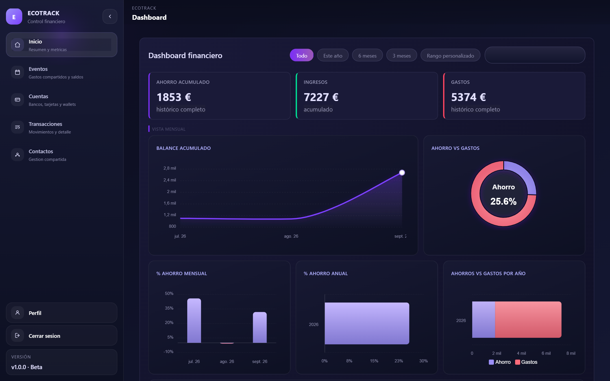
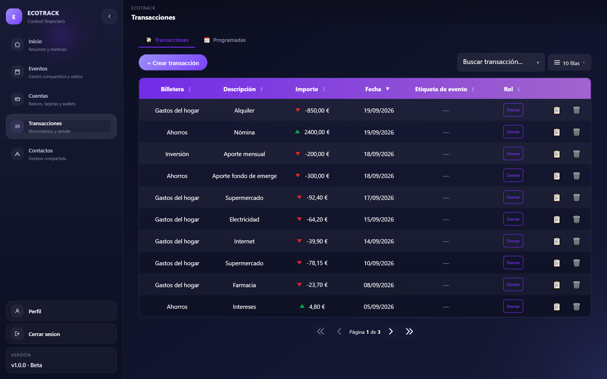
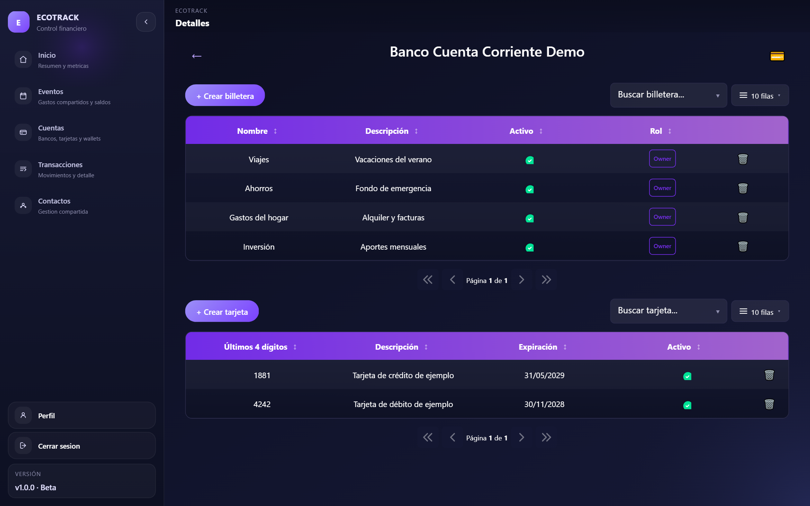
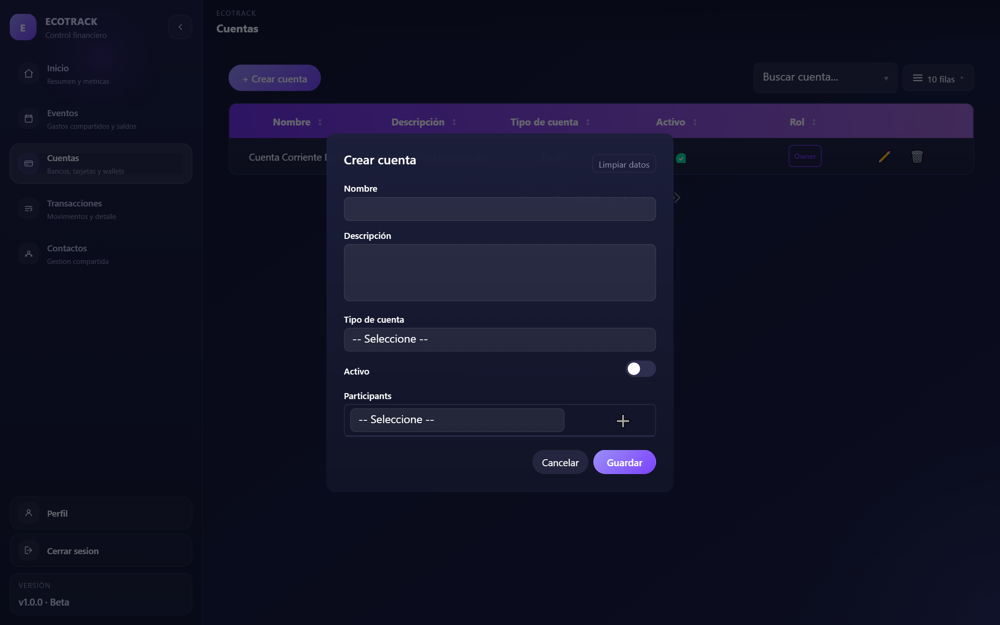

# Qué paquetes usa EcoTrack y cómo

Esta página reúne lo que es **específico de EcoTrack** respecto a los paquetes.
La documentación genérica (instalación, API, ejemplos) está en
[📦 Paquetes](../packages/).

| Paquete | Uso en EcoTrack |
|---|---|
| [Commons.CrudOrm](../packages/commons-crudorm.md) | `AddCommonRepositoryCrud<EcoTrackDbContext>()`. ~30+ Handlers de `EcoTrack.Application` inyectan `ICommonRepository` directo. `ICommonService` no tiene consumidores. `EncryptedStringConverter` cifra `Card.Last4Digits` y `Transaction.Description`. `splitQuery` se usa al cargar `Transaction` con `TransactionParticipants` y `Wallet.WalletParticipants`. |
| [Commons.AuditableLogging](../packages/commons-auditablelogging.md) | `AddAuditableLogging<EcoTrackDbContext>` + `AddAuditableInterceptor`. `Account` usa `IHasUpsertAudit`+`ISoftDeleteable`; `Transaction` además `IAuditable`. `Card`, `Transaction` y `ScheduledTransaction` llegaron a tener su propio `CreatedByUserId` en paralelo antes de que `InsertUser` sellara el Id real. |
| [Commons.ExceptionHandler](../packages/commons-exceptionhandler.md) | Solo `app.UseExceptionHandling()`. Alertas y logging de llamadas en BD **no** están registrados. |
| [Commons.Logging](../packages/commons-logging.md) | Connection string `EcoTrackConnection` (o `sql-connectionstrings` desde Infisical). El job de purga sigue el mismo patrón que `ScheduledTransactionProcessor`. |
| [Commons.BackgroundJobs](../packages/commons-backgroundjobs.md) | `EcoTrack.Infrastructure/BackgroundJobs/ScheduledTransactionProcessor.cs`: procesa plantillas de transacciones recurrentes; intervalo desde `ScheduledTransactionsOptions.PollingIntervalMinutes`; resuelve `IProcessScheduledTransactionsHandler`; registrado en `EcoTrack.Infrastructure/DependencyInjection.cs`. El catch-up del handler tiene tope `MaxCatchUpOccurrences`. |
| [Commons.Infisical](../packages/commons-infisical.md) | `applicationName: "ecotrack"`. |
| [Commons.Testing](../packages/commons-testing.md) | `InMemoryCommonRepository` en `LeaveAccountHandlerTests`, `SaveWalletHandlerTests`, `SaveAccountHandlerTests`, `DeleteAccountHandlerTests`, `VisibilityServiceTests` (`EcoTrack.Application.Tests`). Integración: `EcoTrack.IntegrationTests/DatabaseCollection.cs` toma el fixture por constructor primario. `TestDataBuilder<T>` e `IntegrationTestBase` sin consumidores aún. |
| [Commons.Importing](../packages/commons-importing.md) | Base de la [importación de transacciones](importing-transactions.md). |
| [UiMetadata.Grid](../packages/uimetadata-grid.md) | `BaseController.LoadPartial<T>` envuelve `LoadGridPartial`. `saveEntityUrl` = `Common/Save` en las 4 vistas migradas (Account/Index, Account/Details, Transaction/Index, Participant/Index). Variables de una sola vista como `leaveAccountUrl`, `importEntityUrl`, `openNewView` no se centralizan. Los endpoints JSON devuelven errores de negocio como `{ success: false, error }` (p. ej. límite del plan). |
| [UiMetadata.Modal](../packages/uimetadata-modal.md) | Las 5 entidades implementan `openEntityModal` (tabla abajo). |
| [UiMetadata.Sidebar](../packages/uimetadata-sidebar.md) | Clave de `localStorage` conservada: `"ecotrack.sidebar.collapsed"`. |
| [UiMetadata.Charts](../packages/uimetadata-charts.md) | Layout propio `.chart-grid-top`/`.chart-grid-bot` (2.5fr/1.5fr). |
| [UiMetadata.Contracts](../packages/uimetadata-contracts.md) | Subgrids Wallet/Card abren en modal; clickear una fila de Account navega a `Account/Details`. Los `Result` de los Handlers de `EcoTrack.Application` usan tuplas con nombre (`FkOptionsBuilder` con selectores). |

## `openEntityModal`: entidades y filtro de acceso

| Entidad | Controller | Filtro de acceso |
|---|---|---|
| `Account` | `AccountController.GetAccountById` | `AccountParticipants.Any(ap => ap.Participant.UserId == userId && ap.Participant.IsActive)` |
| `Wallet` | `AccountController.GetWalletById` | `IVisibilityService.ResolvePermissionAsync` (Account→Wallet resuelto) |
| `Card` | `AccountController.GetCardById` | `CreatedByUserId == userId` (Card nunca se comparte) |
| `Transaction` | `TransactionController.GetById` | acceso a la Wallet, o una fila `TransactionParticipant` explícita propia |
| `Participant` | `ParticipantController.GetById` | `OwnerId == userId` (catálogo propio) |

`Wallet`/`Card` comparten convención con placeholder de tipo
(`"/Account/GetDummyById/__ID__"`); `Transaction`/`Participant` tienen una sola
entidad por página y apuntan directo a su `GetById`. Los 5 `GetById` devuelven
`new JsonResult(vm, new System.Text.Json.JsonSerializerOptions())` para no
camelCasear (ver los dos bugs en la página de Modal).

## Cómo se ve cada paquete en EcoTrack

| Paquete | Dónde verlo |
|---|---|
| UiMetadata.Sidebar | Barra lateral de cualquier pantalla |
| UiMetadata.Charts |  |
| UiMetadata.Grid |  |
| UiMetadata.Grid (subgrillas) |  |
| UiMetadata.Modal + Contracts |  |
