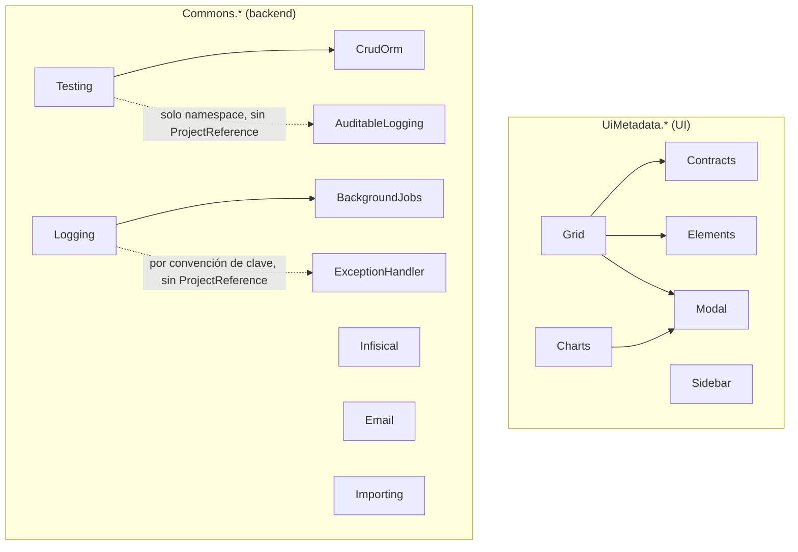
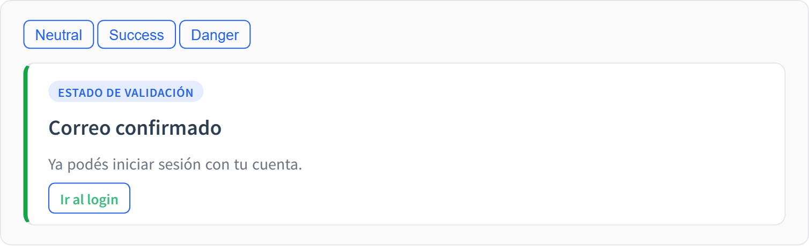
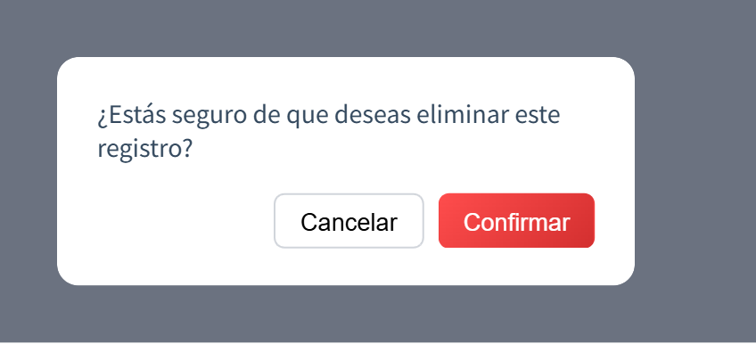
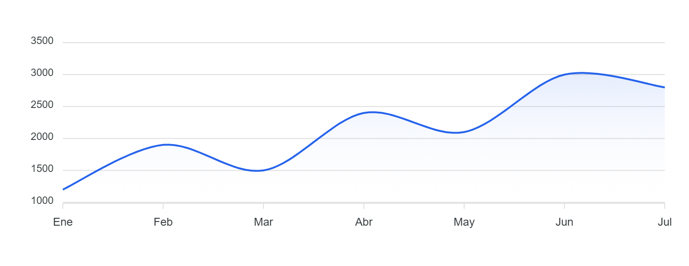
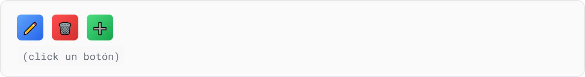
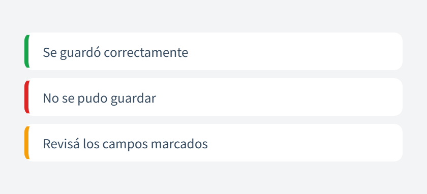

# 📦 Paquetes (NuGet)

> Esta sección documenta **librerías reutilizables**. No sabe nada de EcoTrack ni de
> ningún otro proyecto: los ejemplos son genéricos (Product, Order, Customer…) y
> sirven para copiar a cualquier app .NET.
> ¿Buscás cómo los usa EcoTrack? → [🏠 Proyecto EcoTrack](/ecotrack/uso-de-paquetes.md)

Hay dos familias:

- **`Commons.*`** — Class Libraries de backend, sin UI:
  [CrudOrm](/packages/commons-crudorm.md), [Infisical](/packages/commons-infisical.md), [AuditableLogging](/packages/commons-auditablelogging.md), [ExceptionHandler](/packages/commons-exceptionhandler.md), [Email](/packages/commons-email.md), [Testing](/packages/commons-testing.md), [BackgroundJobs](/packages/commons-backgroundjobs.md), [Logging](/packages/commons-logging.md), [Importing](/packages/commons-importing.md).
- **`UiMetadata.*`** — Razor Class Libraries de UI:
  [Contracts](/packages/uimetadata-contracts.md), [Grid](/packages/uimetadata-grid.md), [Modal](/packages/uimetadata-modal.md), [Elements](/packages/uimetadata-elements.md), [Sidebar](/packages/uimetadata-sidebar.md), [Charts](/packages/uimetadata-charts.md).

Cada página sigue la misma estructura: qué es, cuándo usarlo, instalación,
ejemplo mínimo, archivos a tocar y dependencias.

## Mapa de dependencias

Sin flecha entrante = paquete base, sin dependencias de otro `Commons.*`/
`UiMetadata.*` de este catálogo (`Contracts`, `Elements`, `Modal`,
`Sidebar`, `CrudOrm`, `Infisical`, `ExceptionHandler`, `Email`,
`BackgroundJobs`, `Importing`). Click en cualquier nodo para ir a su página.

## Fuente de verdad

Cada página consolida el `README.md` real de su paquete (dentro de
`EcoTrack/Commons/...`). Si algo queda desactualizado respecto al código, el
`README.md` del paquete manda.

## Galería

Capturas de las demos en vivo de cada paquete (clic en el paquete para ver el detalle y la demo interactiva).

| [UiMetadata.Elements](/packages/uimetadata-elements.md) | [UiMetadata.Modal](/packages/uimetadata-modal.md) | [UiMetadata.Charts](/packages/uimetadata-charts.md) |
|---|---|---|
|  |  |  |
|  |  |  |
