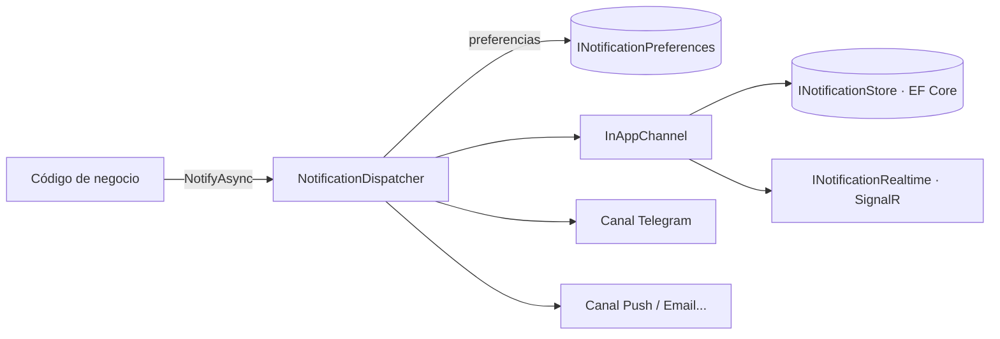

# Commons.Notifications

Notificaciones multicanal sin dominio: un mensaje genérico, un dispatcher que respeta las preferencias del usuario, una
bandeja in-app sobre EF Core y un punto de extensión para canales (Telegram, push, email...). Ningún texto ni regla de
negocio vive aquí: quien consume redacta el mensaje y decide cuándo avisar.

## Cuándo usarlo

Cualquier app .NET que necesite avisar a sus usuarios ("tu importación terminó", "alguien te compartió algo") y quiera
añadir canales después sin tocar el código que dispara los avisos. Solo ese código conoce `INotificationDispatcher`.



## Instalación

```xml
<ProjectReference Include="..\Commons\Commons.Notifications\Commons.Notifications.csproj" />
```

1. En el `DbContext` del consumidor:

```csharp
protected override void OnModelCreating(ModelBuilder modelBuilder)
{
    base.OnModelCreating(modelBuilder);
    modelBuilder.ApplyNotificationsModel();   // tablas Notifications y NotificationPreferences
}
```
y se genera la migración como con cualquier entidad propia.

2. En `Program.cs`:

```csharp
builder.Services.AddNotifications()
    .AddInAppChannel<AppDbContext>()     // bandeja in-app + canal "inapp"
    .AddPreferences<AppDbContext>()      // opcional: sin esto todo está activado
    .AddPurgeJob(readRetentionDays: 30); // opcional: job diario en el propio proceso (Commons.BackgroundJobs)
```

## Uso

```csharp
public class FinishImportHandler(INotificationDispatcher notifications)
{
    public async Task HandleAsync(string userId, int imported)
    {
        await notifications.NotifyAsync(userId, new NotificationMessage(
            Type: "import.finished",                 // clave estable: sobre ella el usuario elige preferencias
            Title: "Importación terminada",
            Body: $"{imported} transacciones importadas",
            Link: "/Transaction",
            Severity: NotificationSeverity.Success,
            DedupKey: "import:2026-09"));            // opcional: no repite mientras haya uno sin leer
    }
}
```

`NotifyAsync` no lanza por un canal que falle: registra el error y devuelve en `DispatchResult` qué canal entregó y cuál
no. `NotifyManyAsync` avisa a varios usuarios (secuencial: los canales comparten `DbContext`).

## Piezas

| Tipo | Qué hace |
|---|---|
| `NotificationMessage` | Tipo, título, cuerpo, enlace, severidad, datos, `DedupKey`, caducidad y `Mandatory` (ignora preferencias) |
| `INotificationDispatcher` | Elige canales según preferencias, entrega con fallos aislados, devuelve el resultado por canal |
| `INotificationChannel` | **Punto de extensión.** `Name` estable + `SendAsync`. Cada canal resuelve el destino del usuario (chat id, token, email) y devuelve `Skipped` si no tiene |
| `INotificationStore` / `EfNotificationStore<TDbContext>` | Bandeja in-app: añadir (con dedup), listar paginado, contar sin leer, marcar leído, borrar, purgar |
| `INotificationPreferences` / `EfNotificationPreferences<TDbContext>` | Usuario × tipo × canal. Todo activado por defecto; la regla específica gana a la general (`"*"`) |
| `INotificationRealtime` | Empuje al navegador (SignalR, SSE). Opcional: por defecto `NullNotificationRealtime` |
| `InAppChannel` | Guarda en la bandeja y empuja en tiempo real; un fallo del empuje no pierde el aviso |
| `ApplyNotificationsModel()` | Registra las tablas en el modelo del consumidor |

## Añadir un canal

```csharp
public class TelegramChannel(ITelegramDestinations destinations, HttpClient http) : INotificationChannel
{
    public string Name => "telegram";

    public async Task<ChannelResult> SendAsync(string userId, NotificationMessage message, CancellationToken ct = default)
    {
        var chatId = await destinations.FindAsync(userId, ct);
        if (chatId is null) return ChannelResult.Skipped(Name, "sin chat vinculado");
        // ... enviar ...
        return ChannelResult.Ok(Name);
    }
}

builder.Services.AddNotifications().AddInAppChannel<AppDbContext>().AddChannel<TelegramChannel>();
```

Lo natural es publicar cada canal como paquete aparte (`Commons.Notifications.Telegram`, `.Push`...) que solo depende de
este: el core no cambia al añadir uno.

## Decisiones y límites
- **Fechas en UTC.** `CreatedAt`/`ReadAt`/`ExpiresAt` se guardan y devuelven en UTC; el cliente las localiza.
- **Sin plantillas ni i18n:** el mensaje llega redactado. Un canal de texto plano usa `Title` y `Body` tal cual.
- **Preferencias fallidas → se entrega.** Si no se pueden leer, es mejor un aviso de más que perderlo.
- **`Mandatory`** salta las preferencias: reservarlo para avisos de seguridad.
- **Purga:** `AddPurgeJob(días)` registra un job diario (`NotificationPurgeService`) que elimina los avisos leídos hace más de
  N días y los caducados; también puede llamarse a mano con `INotificationStore.PurgeAsync(readBefore)`. Las escrituras masivas
  (marcar todas, purga por lotes) usan entidades rastreadas, así que funcionan con cualquier proveedor de EF Core.
- **Las entidades son planas** (`StoredNotification`, `StoredNotificationPreference`): no heredan de ninguna base del
  consumidor. Un interceptor de auditoría que solo actúe sobre entidades con interfaces de auditoría (como `Commons.AuditableLogging`) no las toca.
- **Sin clave foránea a la tabla de usuarios** (el paquete no conoce el modelo de identidad): al eliminar un usuario, el consumidor
  debe borrar también sus avisos y preferencias.
- **No cubre aún:** UI (campana/panel: paquete `UiMetadata.Notifications`), reintentos con backoff de canales externos,
  agrupación de avisos y resumen por email.
