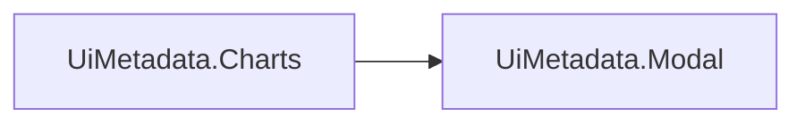

# UiMetadata.Charts

## Qué es

Motor de charts (ApexCharts) + tarjeta de KPI: chrome visual, theming vía
CSS custom properties (`--chart-*`) y el traductor genérico de un
`ChartViewModel` (`Id`/`Type`/`Title`/`Labels`/`Series`/`Options`) a
opciones de ApexCharts según `Type` (`line`/`area`/`bar`/`donut`/`pie`).



## Cuándo usarlo

Para pintar cualquier cantidad de charts/KPIs en cualquier vista. **No hay
"el dashboard"**: cada tarjeta de chart o de KPI es independiente. Un view
puede pintar una sola, veinte, o ninguna — no existe un componente
monolítico que las agrupe. El layout (columnas, proporciones) es 100%
decisión del consumidor, con su propio CSS.

## Instalación

```xml
<ProjectReference Include="..\Commons\UIMetadata\UiMetadata.Charts\UiMetadata.Charts.csproj" />
```

```csharp
builder.Services.AddControllersWithViews()
    .AddUiMetadataCharts(); // registra también UiMetadata.Modal en cascada
```

```csharp
@section Styles {
    @await Html.PartialAsync("~/Views/Shared/_ChartsStyles.cshtml")
}
@await Html.PartialAsync("~/Views/Shared/_ChartsScripts.cshtml")
```

`_ChartsStyles.cshtml` (solo `charts.css`) y `_ChartsScripts.cshtml`
(ApexCharts CDN + `charts.js`) están separados a propósito, no es solo
prolijidad — requiere que `_Layout.cshtml` tenga
`@await RenderSectionAsync("Styles", required: false)` en el `<head>`.
Motivo real: `_ChartsScripts.cshtml` va al final del `<body>` (con el resto
de `<script>`); si `charts.css` viajaba pegado ahí, el navegador pintaba el
HTML de cada `.chart-card` **antes** de procesar ese `<link>` — durante ese
lapso (que coincide con la ventana en la que el chart todavía ni tiene
datos) las tarjetas se veían sin estilo, un cuadrado blanco en vez del
fondo oscuro de `.chart-card`, hasta que el CSS terminaba de aplicarse. El
JS sí puede seguir al final del body sin este problema — solo el CSS causa
ese flash.

Ninguno de los dos partials forma parte de `_UiMetadataStyles.cshtml`/
`_UiMetadataScripts.cshtml` (los agregadores de toda la familia) — no todas
las páginas tienen charts, así que no deben cargar global. Cada vista con
`_ChartCard.cshtml` incluye ambos por su cuenta.

La versión/`integrity` de ApexCharts vive en `_ChartsScripts.cshtml`, no en
la vista consumidora — `charts.js` está escrito contra la API de una
versión concreta; si el pin viviera en cada vista, un cambio ahí podría
romper `charts.js` sin tocar la RCL en absoluto.

## Ejemplo mínimo de uso — Chart

```csharp
@await Html.PartialAsync("~/Views/Shared/_ChartCard.cshtml", new UiMetadata.Charts.Models.ChartCardModel
{
    Id = "balanceChart", Title = "Balance acumulado"
})
```

```js
const charts = await (await fetch(loadChartUrl)).json(); // shape { id, type, title, labels, series, options }
charts.forEach(c => renderChart(c, `#${c.id}`));
```

`ChartCardModel.Id` tiene que coincidir con el `Id` que devuelve tu backend
para ese chart — es la clave que conecta la tarjeta con `renderChart`. El
botón "expandir" ya viene cableado (`onclick="openChartModal('Id')"`) —
no hace falta ningún setup de JS aparte.

**Demo en vivo** — un chart `area` real, renderizado con ApexCharts (cargado
solo en esta página, igual que hace `_ChartsScripts.cshtml` en la app real):

<div style="border:1px solid #e5e7eb;border-radius:10px;padding:1rem 1.2rem;margin:1rem 0;">
  <div id="dd-chart-demo" style="min-height:220px;"></div>
</div>

### El modal de "expandir" (una sola vez por página)

```csharp
@await Html.PartialAsync("~/Views/Shared/_ChartModal.cshtml")
```

Sea cual sea la cantidad de `_ChartCard.cshtml`, esta partial se incluye
**una sola vez** — `openChartModal(id)` resuelve qué chart mostrar contra
el registro interno de `charts.js` (se completa solo al llamar
`renderChart`). Reusa el chrome `.ui-modal`/`.ui-modal-content-lg` de
`UiMetadata.Modal` en vez de un sistema de modal aparte.

## Ejemplo mínimo de uso — KPI card

```csharp
@await Html.PartialAsync("~/Views/Shared/_KpiCard.cshtml", new UiMetadata.Charts.Models.KpiCardModel
{
    Id = "kpi-savings", Label = "Ahorro acumulado"
})
```

```js
document.getElementById("kpi-savings").textContent = "1.234 €"; // Id = id del <div class="kpi-value">
setKpiBadge("kpi-savings-badge", 12.5, "% vs año anterior"); // badge con signo, verde/rojo
```

`Accent`: `null`/`"primary"` (default), `"success"` o `"danger"` — controla
el borde izquierdo de la tarjeta. `InitialValueText`/`InitialBadgeText` son
el placeholder mientras tu fetch todavía no respondió (default: `"—"` /
`"cargando..."`).

**Demo en vivo**:

<style>
.dd-kpi-card { display: inline-block; min-width: 200px; border-radius: 10px; border: 1px solid #e5e7eb; border-left: 4px solid #2563eb; padding: .9rem 1.1rem; margin-right: 1rem; }
.dd-kpi-card.dd-success { border-left-color: #16a34a; }
.dd-kpi-card.dd-danger { border-left-color: #dc2626; }
.dd-kpi-label { font-size: .78rem; color: #6b7280; text-transform: uppercase; letter-spacing: .04em; }
.dd-kpi-value { font-size: 1.5rem; font-weight: 700; margin: .2rem 0; }
.dd-kpi-badge { font-size: .78rem; padding: 2px 8px; border-radius: 999px; }
.dd-kpi-badge.dd-pos { background: rgba(22,163,74,.12); color: #16a34a; }
.dd-kpi-badge.dd-neg { background: rgba(220,38,38,.12); color: #dc2626; }
</style>
<div>
  <div class="dd-kpi-card">
    <div class="dd-kpi-label">Ahorro acumulado</div>
    <div class="dd-kpi-value">1.234 €</div>
    <span class="dd-kpi-badge dd-pos">▲ 12.5% vs año anterior</span>
  </div>
  <div class="dd-kpi-card dd-danger">
    <div class="dd-kpi-label">Gastos</div>
    <div class="dd-kpi-value">890 €</div>
    <span class="dd-kpi-badge dd-neg">▼ 4.2% vs mes anterior</span>
  </div>
</div>

## `chart.options` — opciones custom de ApexCharts desde el backend

El motor mergea `chart.options` (lo que mande tu backend, cualquier forma
válida de opciones de ApexCharts) sobre las opciones base que arma según
`type` — los colores del tema tienen prioridad salvo que el backend mande
`colors` explícito. Para el `total.label` del centro de un chart `donut`
(texto libre, ej. "Ahorro"), pasá `donutTotalLabel` en `Options` — el motor
no tiene ningún texto de negocio hardcodeado, sin esto cae al genérico
`"Total"`. `donutTotalValue` (texto libre) reemplaza el valor del centro, que
por defecto es el % del primer valor sobre el total. Un donut no puede
dibujar valores negativos: el backend debe mandar los datos en positivo.

## Archivos a tocar/crear al integrarlo en un proyecto nuevo

1. `ProjectReference` + `.AddUiMetadataCharts()`.
2. `_ChartsStyles.cshtml` (vía `@section Styles`, requiere esa sección en el `<head>` de `_Layout.cshtml`) + `_ChartsScripts.cshtml`, en cada vista con charts — no en el layout global.
3. `_ChartCard.cshtml`/`_KpiCard.cshtml` por cada chart/KPI.
4. `_ChartModal.cshtml` una sola vez por página.
5. Un endpoint backend que devuelva `ChartViewModel[]` con el shape esperado.
6. El propio layout de columnas (CSS) — el paquete no ofrece utilidades `.charts-grid-N`, cada consumidor arma el suyo (ej. `.chart-grid-top`/`.chart-grid-bot` de EcoTrack, 2.5fr/1.5fr, es decisión de esa página, no del paquete).

## Design tokens (`--chart-*`, sin capa `:root` propia)

A propósito no hay bloque `:root` en `charts.css` — a diferencia de
`grid.css` (donde `--grid-*` deriva de tokens base con
`var(--token-base, literal)`), acá `--chart-card-shadow` y compañía **son**
los tokens finales que el consumidor define directo en su tema. Un `:root`
con la misma especificidad en este paquete pisaría ese valor real según el
orden de carga de los `<link>` — el fallback vive en el punto de uso.

| Token | Usado por |
|---|---|
| `--chart-card-bg-start`/`-end`, `-border`, `-shadow`, `-hover-shadow`, `-hover-border` | `.chart-card` |
| `--chart-kpi-hover-shadow` | `.kpi-card:hover` |
| `--chart-positive`/`-positive-end`/`-negative`/`-negative-end` | Colores de series (leídos por JS, `charts.js`) |
| `--chart-area-start`/`-end` | Gradiente de charts `line`/`area` |
| `--chart-grid-soft`/`-strong`, `--chart-donut-track`, `--chart-glow`, `--chart-marker-fill`, `--chart-donut-label`/`-value`, `--chart-stroke-contrast`, `--chart-tooltip-theme`, `--chart-theme-mode`, `--chart-bg` | Resto del theming de ApexCharts, leído por JS |

Los "leídos por JS" no tienen fallback en CSS — el `cssVar(name, fallback)`
de `charts.js` tiene su propio segundo argumento para eso.

## Dependencias

`UiMetadata.Modal` (reusa `.ui-modal`/`.ui-modal-content-lg` para el modal
de "expandir chart" en vez de un sistema propio).
