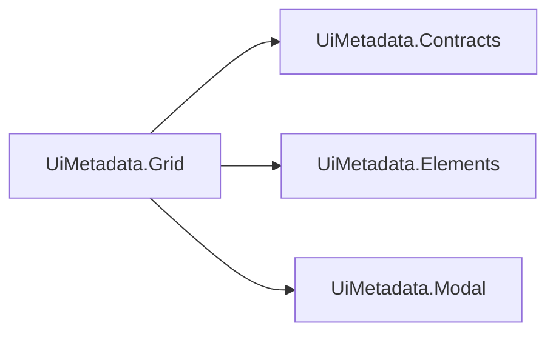

# UiMetadata.Grid

## Qué es

Tabla/listado con paginación y búsqueda, más el modal de crear/editar y el
subgrid con mini-modal de edición inline. Renderiza vía reflection sobre un
ViewModel decorado con los atributos de `UiMetadata.Contracts`, delegando el
chrome de controles atómicos en `UiMetadata.Elements`/`UiMetadata.Modal`.



## Cuándo usarlo

Cuando necesitás un CRUD tabular completo (listar, buscar, paginar, crear,
editar, borrar, subgrids anidados) sin escribir el HTML/JS de la tabla a
mano por cada entidad — el ViewModel + sus atributos de `UiMetadata.Contracts`
son suficientes para que el sistema genere todo.

## Instalación

```xml
<ProjectReference Include="..\Commons\UIMetadata\UiMetadata.Grid\UiMetadata.Grid.csproj" />
```

```csharp
builder.Services.AddControllersWithViews()
    .AddUiMetadataGrid(); // registra también Elements y Modal en cascada
```

```html
<head>
    ...
    @await Html.PartialAsync("~/Views/Shared/_UiMetadataStyles.cshtml")
</head>
<body>
    ...
    <script src="jquery..."></script>
    <script src="jquery-validate..."></script>
    <script src="jquery-validate-unobtrusive..."></script>
    @await Html.PartialAsync("~/Views/Shared/_UiMetadataScripts.cshtml")
</body>
```

`_UiMetadataScripts.cshtml` ya incluye el `_ToastContainer` (una sola vez
por página) y carga toast/confirm/elements/grid en el orden correcto —
también [flatpickr](https://flatpickr.js.org/) (CDN, versión/`integrity`
fijas), que reemplaza al `<input type="date">` nativo en cualquier campo de
fecha (ver página de Elements, `_DateInput.cshtml`). Global, no opt-in por
página como `UiMetadata.Charts` — cualquier grid con un campo de fecha lo
usa.

> ⚠️ **`toast.js` y `confirm.js` de `UiMetadata.Modal` son una dependencia
> de runtime real de `grid.js`, no solo chrome opcional**: `grid.js` llama
> directo a `toastWarning`/`toastError`/`confirmDialog` (validaciones de
> subgrid, borrado de fila, errores de red). Sin `_UiMetadataScripts.cshtml`
> esas llamadas lanzan `ReferenceError` en runtime — sin try/catch
> defensivo, a propósito, para que un error de integración sea ruidoso en
> desarrollo en vez de fallar en silencio.

(El `<select>` de `UiMetadata.Elements` no trae JS propio para la cascada —
la sigue resolviendo `grid.js`.)

## Ejemplo mínimo de uso

```csharp
using UiMetadata.Contracts.Grid;
using UiMetadata.Grid.Extensions;

var config = GridConfigBuilder.Build<AccountViewModel>();
return this.LoadGridPartial(accounts, config);
```

`BaseController.LoadPartial<T>` en EcoTrack ya envuelve esto.

## Archivos a tocar/crear al integrarlo en un proyecto nuevo

1. `ProjectReference` + `.AddUiMetadataGrid()` en el `.csproj`/`Program.cs` consumidor.
2. `_UiMetadataStyles.cshtml`/`_UiMetadataScripts.cshtml` en `_Layout.cshtml` (después de jQuery/jquery-validate).
3. Definir los 2 globals JS obligatorios en cada vista que use el grid — `loadEntityUrl`/`saveEntityUrl` (ver tabla completa abajo), idealmente vía `_GridEntityConfig.cshtml` en vez de a mano.
4. El ViewModel de cada entidad decorado con atributos de `UiMetadata.Contracts`.
5. Un controller con una acción que llame `GridConfigBuilder.Build<T>()` + `LoadGridPartial`.

### Globals de JavaScript que el consumidor debe definir

Solo **2 son obligatorios** (las URLs de tu backend, imposibles de
adivinar); el resto tiene default razonable:

| Global | Obligatorio | Usado por | Firma esperada |
|---|---|---|---|
| `loadEntityUrl` | Sí | `loadEntity` | string con placeholder `"Dummy"` a reemplazar por la acción, ej. `"/Account/Dummy"`. |
| `saveEntityUrl` | Sí | submit del modal, `handleGridDeleteClick` (usa `.replace("/Save", "/Delete")`) | URL de POST para guardar. |
| `showLoader` / `hideLoader` | No — default no-op | Varias funciones AJAX | `function(): void`. |
| `loadEntityAction` | No — default: el nombre del tipo sin el sufijo `ViewModel` | `toggleInactiveFilter` | Nombre de la acción a pasar a `loadEntity`. Solo definilo si tu acción no sigue esa convención. |
| `openEntityView` | No | `openFormModal`, `openGridRowModal` | `function(entity: object \| null): boolean` — si devuelve `true`, el grid no abre su propio modal. |
| `openNewView` | No (solo si `RowClickAction`/`DetailsButtonAction` usan `"Details"`) | `openGridRowDetails` | URL de destino del POST de navegación a detalle. |
| `openImportModal` | No (solo si `GridConfig.ShowImportButton = true`) | Botón "Importar archivo" | `function(): void`. |
| `getEntityUrl` | No | `openGridRowModal` | string con placeholders `"Dummy"` (tipo) y `"__ID__"` (id). Si está definida, hacer clic en una fila para editar **pide el registro fresco al backend** en vez de reusar el `data-entity` embebido en la fila. Sin esto, cero fetch extra, se abre el modal con lo que ya venía en la fila. |
| `uiMetadataFetch` | No — se autodefine como `window.fetch` si no existe | `loadEntity`, `handleGridDeleteClick`, submit del modal, y `openGridRowModal` cuando `getEntityUrl` está definida | `function(url, options): Promise<Response>`, misma firma que `fetch`. Redefinilo **antes** de la primera petición para enrutar toda la RCL por tu propia lógica de auth (agregar un header, refrescar un token, reintentar en 401) sin tocar `grid.js`. |

### Generar los globals con `_GridEntityConfig.cshtml`

```csharp
@await Html.PartialAsync("~/Views/Shared/_GridEntityConfig.cshtml", new UiMetadata.Grid.Models.GridEntityConfigModel
{
    Controller = "Account",       // resuelve loadEntityUrl y (salvo GetByIdController) getEntityUrl
    LoadEntityAction = "Account", // solo si tu tipo no sigue la convención por defecto
})
```

`saveEntityUrl` sale siempre de `Common/Save` (así fue en las 4 vistas
migradas en EcoTrack — Account/Index, Account/Details, Transaction/Index,
Participant/Index — sin excepción, por eso no hace falta pasarlo). Los
demás campos (`LoadAction`, `GetByIdAction`, `GetByIdController`,
`IncludeGetEntityUrl=false`) cubren las variantes reales entre controllers.

**Qué NO centralizar acá, a propósito**: variables de una sola vista
(`leaveAccountUrl`, `importEntityUrl`, `openNewView`, etc.) — no se repiten
entre pantallas, forzarlas a un mecanismo genérico agregaría indirección
sin reducir duplicación real.

`Url.Action` sigue sin validar el nombre de controller/action en
compilación — un typo no se detecta antes de correr la página, pero si el
backend no encuentra la acción, `openEntityModal`/`loadEntity` fallan con
un `toastError`/404 visible, no en silencio.

## Fix: `DateOnly` sin padear y celdas vacías sin ninguna señal

`_Grid.cshtml` solo tenía un caso especial para `DateTime` (`dd/MM/yyyy`) —
`DateOnly` caía al genérico y se veía sin ceros a la izquierda ("1/1/2023").
Ahora tiene su propio caso, mismo formato. De paso, un valor `null`/vacío
en cualquier columna muestra un placeholder "—" (`.table-cell-empty`) en
vez de una celda en blanco sin ninguna señal — sin configuración, aplica a
cualquier columna que no tenga ya su propio renderer (bool/badge/sign
indicator).

## Buscador: filtrar por columna (una o varias a la vez)

Por defecto el buscador (`_GridControls.cshtml`) matchea contra el texto
completo de la fila. Para acotarlo a columnas específicas:

```csharp
config.SearchableFields = [nameof(AccountViewModel.Name), nameof(AccountViewModel.Description)];
```

Con eso, `_GridControls.cshtml` agrega un botón "Columnas ▾" que despliega
un checkbox por cada campo de `SearchableFields` (con su `[DisplayName]`) —
solo se renderiza si hay más de una columna buscable. Es multi-selección:
matchea si **cualquiera** de las marcadas (OR) contiene el término, contra
la celda `[data-field="..."]` correspondiente en vez de toda la fila. Todas
empiezan marcadas; "todas marcadas" y "ninguna marcada" se tratan igual
(buscar en toda la fila). `SearchableFields = null` (default) = sin
dropdown, buscador de siempre.

**Limpiar búsqueda**: botón ✕ (`.search-clear`, solo visible con texto) y
`Escape` en el input vacían el buscador y devuelven el foco.

## Orden por columna (click en el header, "como Excel")

Cualquier header de columna con datos reales (no las de acción, ni la
sintética `ButtonForURL`) es clickeable y ordena el grid — el ícono pasa de
`↕` a `▲`/`▼` según la dirección. Mismo campo = alterna asc/desc; campo
distinto = arranca en ascendente. Sin tercer estado "sin ordenar" a
propósito (dos clicks alcanzan).

Ordena por el **valor real** de cada fila (lo saca de `data-entity`, el
JSON que cada `.table-row` ya trae para el modal de edición), no por el
texto ya formateado de la celda. El comparador detecta números, fechas ISO
y texto (`localeCompare` español, `numeric: true`). Reordena los nodos del
DOM de verdad, así el rayado zebra también queda correcto en el nuevo
orden.

**Limitación conocida**: una columna que muestra un valor ya formateado
(ej. `AmountFormatted`, texto tipo "1.234,56 €") ordena como texto, no
numéricamente — puede dar un orden raro entre montos de distinta cantidad
de dígitos. No hay ningún atributo `[SortKey]` para resolverlo hoy.

### `[DefaultSort]` — orden inicial

```csharp
[DefaultSort(Descending = true)]
public DateOnly TransactionDate { get; set; }
```

El grid arranca ordenado por esa columna (mismo comparador de arriba) en
vez del orden del backend, con el header ya marcado ▲/▼ desde el primer
render. Sin `[DefaultSort]` en el ViewModel, el grid se comporta
exactamente como antes.

## Íconos de signo en columnas de importe (`[SignIndicatorField]`)

```csharp
[SignIndicatorField(nameof(Amount))]
public string AmountFormatted { get; set; }
```

Antepone ▲ verde (positivo/cero) o ▼ roja (negativo) a la celda
(`_SignIndicator.cshtml`, mismos tokens que `[BoolIcon]`). El argumento es
el nombre de OTRA propiedad del ViewModel de la que leer el signo real —
necesario cuando la columna visible es un valor ya formateado (como acá,
`AmountFormatted` vs. el `Amount` decimal crudo). Sin argumento, usa el
valor de la propia columna.

## Fix: guardar/editar ya no recarga toda la página (y por fin se ve el toast)

`submitModalForm` hacía `location.reload()` al guardar con éxito —
navegación completa de la página. Dos problemas reales: cualquier toast de
éxito quedaba tapado por la navegación (de hecho no había ningún
`toastSuccess` en absoluto, se agregó), y se perdía todo el estado de la
tabla (orden/búsqueda/página/filas por página).

Ahora `loadEntity` cachea cómo cargó cada grid (`gridLoadCache`) y
`refreshGrid(containerId)` reusa esa cache para recargar **solo esa
tabla**, ubicando el `containerId` correcto desde el `<form>` hasta su
`.partial-container` más cercano. `gridUiStateCache` guarda
orden/búsqueda/página/filas por página/columnas de búsqueda marcadas y las
restaura al volver a cargar — gana sobre `[DefaultSort]`, por ser una elección
más reciente y explícita del usuario. La clave es el id del
`.partial-container` (estable), no `gridId`, que lleva un GUID nuevo por
render y hacía que el estado nunca se encontrara tras refrescar. Corrige el flujo de cualquier grid: es el único
punto de guardado que usa todo el paquete.

## Tipografía de tabla en mobile (≤599px)

Cabecera a `0.78rem`, filas a `0.82rem`, íconos de orden/signo más chicos: en
iPhone 13 mini (375px) / 14 Pro (390px) cada columna mide ~76-81px y
`Descripción` + su ícono se recortaba por ambos lados (`overflow: hidden` sobre
un flex centrado). Ahora usa `justify-content: safe center`. Grids con muchas
columnas deben marcar las prescindibles con `[GridPriority]`; sin prioridades,
13 columnas se apretaban a ~17px cada una.

## Barra de controles en mobile: buscador colapsable, menú de filas, "+ Crear" como ícono

Arriba de 599px no cambia nada. Por debajo, para que buscador + selector de
filas + botón de alta entren en una sola fila sin saltar de línea:

- **"+ Crear"** se ve como ícono circular (mismo handler que el botón de
  texto).
- **El buscador** arranca colapsado a un ícono de lupa. Al tocarlo,
  `.search-box` se expande con `position: absolute` (transición de
  `max-width`, no de `display`, para poder animarla) mientras "+ Crear" y
  el ícono de filas se desvanecen con opacity — se colapsa con el botón ✕
  de adentro, `Escape` o tocando afuera.
- **El selector de filas por página** es un menú contextual (ícono + "N
  filas" + ▾), no un `<select>` nativo — el `<select>` real sigue en el DOM
  pero oculto, como fuente de verdad para `grid.js`.

Dos bugs reales para quien toque esto de nuevo: (1) `overflow:hidden` en un
wrapper recorta cualquier panel absoluto que se abra adentro, sin importar
el `z-index` — el colapso animado tiene que vivir en el elemento visible
(el botón), no en el contenedor que también aloja el panel. (2) un wrapper
`position:relative` sin `pointer-events:none` propio pinta por encima de
contenido `position:absolute` anterior en el HTML y se queda con los clics
de esa zona en silencio, aunque no tenga contenido visible propio.

## Bloqueo de campos en el subgrid (`LockedFields`) y valores por defecto

El mini-modal de subgrid bloquea ciertos campos con `lockField(field)` en vez
de `field.disabled = true` — un input `disabled` no viaja en el `FormData`
del submit, así que bloquear un campo así lo excluía silenciosamente del
guardado (causó bugs reales: "La billetera no existe" al editar una
Transaction con un campo bloqueado). `lockField` usa `readOnly` en inputs de
texto/número, y la clase `.field-locked` (`pointer-events: none`) + `tabIndex
= -1` en `<select>`/checkbox/radio, que no soportan `readonly`.
`UiMetadata.Modal`'s `openFormModal` limpia los tres marcadores al resetear
el formulario.

`[SubgridEditable(DefaultValue = ...)]` (ver página de `UiMetadata.Contracts`)
rellena el campo con ese valor al crear una fila NUEVA del subgrid
(`applySubgridDefaults` en `grid.js`) — nunca pisa un valor ya presente, así
que una fila cargada desde la base de datos no se ve afectada.

## Ocultamiento progresivo de columnas (`[GridPriority]`)

Para tablas que no entran en pantallas angostas: en vez de achicar todas las
columnas hasta volverlas ilegibles (o forzar scroll horizontal), se ocultan
las prescindibles y cada fila gana un botón ▸ que despliega sus valores
(patrón "FooTable").

```csharp
[DisplayName("Nombre")]                        // sin atributo = "core", nunca se oculta
public string Name { get; set; }

[GridPriority(2)] [DisplayName("Descripción")] // mayor número = se oculta primero
public string Description { get; set; }

[GridPriority(1)] [DisplayName("Activo")]      // se oculta después
public bool Enabled { get; set; }
```

- Al iniciar, al cambiar el ancho de la ventana y al mostrarse su pestaña
  (`tab:shown`), `grid.js` mide las columnas de datos; si alguna queda debajo
  de 90px, oculta la de mayor prioridad y repite hasta que todas entren.
- Las columnas de acción (editar/eliminar/acción custom) nunca se ocultan.
- Solo recalcula si cambió el **ancho** — en móvil la barra de direcciones
  dispara `resize` al scrollear, y sin ese corte se cerraba la fila desplegada.
- La fila desplegada reusa el contenido ya renderizado, sin pedido extra al
  servidor; el clic en ▸ no dispara la acción de la fila.

Sin ningún `[GridPriority]`, nada de esto se activa. **Limitación conocida**:
un cambio de ancho del contenedor sin `resize` de ventana (ej. colapsar el
sidebar en desktop) no re-adapta las columnas hasta el próximo resize.

## Clonar fila (`GridConfig.GridCloneEnabled`)

`config.GridCloneEnabled = true` agrega un botón 📋 por fila, entre editar y
eliminar: abre el modal precargado con los datos de esa fila pero **siempre
crea un registro nuevo al guardar**, nunca sobreescribe la original. Off por
defecto.

```csharp
var config = GridConfigBuilder.Build<TransactionViewModel>(fkOptions);
config.GridCloneEnabled = true;
```

- 100% front: el backend recibe el mismo POST de "crear" de siempre (sin
  `Id`) — no hace falta ningún endpoint ni cambio en el handler de guardado.
- `handleGridCloneClick` → `openGridRowModal(row, isClone = true)` hace el
  mismo `fillModalForm` que "Editar" y luego vacía el input `Id` — el
  listener de `submit` decide crear vs. editar solo mirando si ese input
  tiene valor, así que basta con eso.
- Título del modal → "Clonar {Entidad}"; `LockedFields`/`HiddenFields`/
  `IsReadOnlyRow` de la fila original no se aplican (es un alta nueva, con
  los mismos permisos que "Crear"). Gated por `CanOpenModal`, igual que
  editar.

## Acciones compactas en móvil (menú contextual)

Debajo de 599px de viewport, las columnas de acción (editar/ver, clonar,
eliminar, acción custom de `GridConfig.RowAction`) se reemplazan por una sola
columna de 44px: un botón `⋮` con menú contextual si la fila tiene 2+
acciones, la acción directa si tiene una sola, o nada si no tiene ninguna.

- Sin configuración: el menú se arma con los botones ya renderizados en la
  fila (`data-field="__details"`/`"__clone"`/`"__delete"`/`"__rowaction"`), así que los
  permisos por fila se respetan solos y cada opción dispara el botón original
  (mismos handlers, mismo `confirmDialog`).
- El texto de cada opción es el `title` del botón (`"Editar"`, `"Ver detalle"`,
  `"Eliminar"`, o el `Title` del `RowAction`).
- Menú `position: fixed` en `<body>`; se cierra con clic afuera, `Escape` o
  scroll. Tocar `⋮` no dispara la acción de la fila.
- Se combina con `[GridPriority]` (el espacio liberado permite mostrar más
  columnas). Aplica a cualquier grid con acciones; arriba de 599px no cambia.

## Convenciones por nombre de propiedad

Ver la tabla "Flags leídos por convención de nombre" en la página de
`UiMetadata.Contracts` — son los mismos 4 flags (`CanOpenModal`,
`CanDeleteRow`, `CanRowAction`, `IsInactiveRow`), y `RowClickAction`/
`DetailsButtonAction` de `GridConfig`.

`--grid-control-h` (2.75rem) es el alto compartido por todos los controles
de la barra superior del grid (buscador, menú de filas, "+ Crear" y sus
versiones ícono en mobile) — un control nuevo en esa barra debería usar
este token en vez de un alto propio.

## Design tokens (`--grid-*`, `wwwroot/css/grid.css`)

| Categoría | Tokens |
|---|---|
| Radios | `--grid-radius-sm`=`6px`, `-md`=`8px`, `-lg`=`12px`, `-pill`=`50px` |
| Espaciado | `--grid-gap-xs`=`0.4rem`, `-sm`=`0.5rem`, `-md`=`1rem` |
| Tipografía | `--grid-font-size-sm`=`0.875rem`, `-md`=`0.92rem`, `-base`=`0.95rem`, `-lg`=`1.3rem`, `-h2`=`1.8rem` |
| Texto | `--grid-text-main`=`var(--text-main,#111827)`, `-muted`=`var(--text-muted,#6b7280)`, `-on-btn`=`var(--text-on-accent,#fff)` |
| Superficies | `--grid-surface`=`var(--bg-card,#fff)`, `-alt`=`var(--bg-elevated,#f9fafb)`, `--grid-border`=`var(--border-soft,#e5e7eb)`, `-input`=`var(--border-strong,#d1d5db)` |
| Tabla | `--grid-table-header-bg`=`var(--table-header-bg, linear-gradient(135deg,#2563eb,#1d4ed8))`, `-row-hover`=`var(--table-row-hover,#e0f2fe)`, `-row-alt`=`var(--table-row-alt,#f9fafb)`, `-border-badge`=`var(--table-border-badge, 1px solid #6b7280)` |
| Modal | `--grid-modal-overlay`=`rgba(0,0,0,.5)`, `-surface`=`var(--modal-surface,#fff)`, `-shadow`=`var(--modal-shadow, 0 8px 25px rgba(0,0,0,.15))`, `-width`=`500px`, `-max-h`=`95%` |
| Inputs | `--grid-input-bg`=`var(--input-bg,#fff)`, `-border`=`var(--input-border,#d1d5db)`, `-border-focus`=`var(--input-border-strong,#2563eb)` |
| Botones primario/secundario/danger/éxito | `--grid-btn-primary-bg`=`var(--interactive-accent-glow, linear-gradient(135deg,#60a5fa,#2563eb))`, `--grid-btn-secondary-bg`=`var(--filter-bg,#d1d5db)`, `--grid-btn-danger-bg-full`=`linear-gradient(135deg,#ff4d4d,#d32f2f)`, `--grid-btn-success-bg`=`linear-gradient(135deg,#4ade80,#16a34a)` |
| Paginación | `--grid-pagination-bg`=`var(--table-header-bg, ...)`, `-bg-dark`=`#0C2442`, `-btn-size`=`38px` |
| Íconos bool | `--grid-icon-true`=`var(--color-success,#16a34a)`, `-false`=`var(--color-danger,#dc2626)`, `--grid-bool-icon-size`=`34px` |
| Subgrid | `--grid-subgrid-border`=`var(--border-soft,#ddd)`, `-row-hover`=`var(--hover-bg,#f1f1f1)`, `-max-h`=`200px` |
| Validación | `--grid-error-border`=`var(--error-border-strong,#dc3545)`, `-text`=`var(--error-text,#dc3545)` |

~90 tokens en total. Todos los paquetes `UiMetadata.*` reutilizan los
mismos nombres con su propio fallback, así que sobreescribir uno en el
tema del consumidor basta para todos. Ver el archivo completo
(`wwwroot/css/grid.css`, líneas 1-110 aprox.) para la lista exhaustiva.

## Estado de la modularización (para quien contribuya al paquete)

El plan original separaba esto en `UiMetadata.Grid` (tabla) y
`UiMetadata.Subgrid` (subgrid + mini-modal) como dos `.csproj` distintos.
Esa separación física **no se completó** — sigue siendo un único proyecto.
Motivo: es la fase de mayor riesgo de regresión (mover `_Grid.cshtml`, el
archivo central de todo el sistema, sin poder probarlo en un navegador
contra una BD real). Lo que sí se completó: extraer los componentes
atómicos con evidencia real de duplicación (`Elements`/`Modal`), dejando
`_Grid.cshtml` mucho más corto. El ciclo de vida del modal
(`openFormModal`/`fillModalForm`/etc.) también se movió de acá a
`UiMetadata.Modal` — Grid ya no lo posee, solo lo sigue usando.

## Dependencias

`UiMetadata.Contracts` (atributos), `UiMetadata.Elements` y `UiMetadata.Modal`
(chrome de controles atómicos y ciclo de vida del modal) — las tres se
registran en cascada con `.AddUiMetadataGrid()`.
