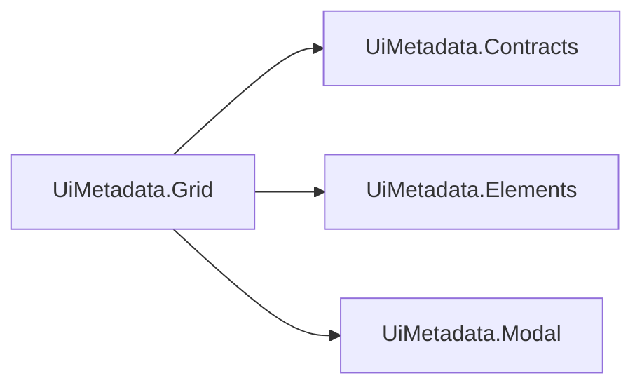

# UiMetadata.Grid

## Qué es

Tabla/listado con paginación y búsqueda, más el modal de crear/editar y el
subgrid con mini-modal de edición inline. Renderiza vía reflection sobre un
ViewModel decorado con los atributos de `UiMetadata.Contracts`, delegando el
chrome de controles atómicos en `UiMetadata.Elements`/`UiMetadata.Modal`.



## Cuándo usarlo

Cuando necesitás un CRUD tabular completo (listar, buscar, paginar, crear,
editar, borrar, subgrids anidados) sin escribir el HTML/JS de la tabla a
mano por cada entidad — el ViewModel + sus atributos de `UiMetadata.Contracts`
son suficientes para que el sistema genere todo.

## Instalación

```xml
<ProjectReference Include="..\Commons\UIMetadata\UiMetadata.Grid\UiMetadata.Grid.csproj" />
```

```csharp
builder.Services.AddControllersWithViews()
    .AddUiMetadataGrid(); // registra también Elements y Modal en cascada
```

```html
<head>
    ...
    @await Html.PartialAsync("~/Views/Shared/_UiMetadataStyles.cshtml")
</head>
<body>
    ...
    <script src="jquery..."></script>
    <script src="jquery-validate..."></script>
    <script src="jquery-validate-unobtrusive..."></script>
    @await Html.PartialAsync("~/Views/Shared/_UiMetadataScripts.cshtml")
</body>
```

`_UiMetadataScripts.cshtml` ya incluye el `_ToastContainer` (una sola vez
por página) y carga toast/confirm/elements/grid en el orden correcto.

> ⚠️ **`toast.js` y `confirm.js` de `UiMetadata.Modal` son una dependencia
> de runtime real de `grid.js`, no solo chrome opcional**: `grid.js` llama
> directo a `toastWarning`/`toastError`/`confirmDialog` (validaciones de
> subgrid, borrado de fila, errores de red). Sin `_UiMetadataScripts.cshtml`
> esas llamadas lanzan `ReferenceError` en runtime — sin try/catch
> defensivo, a propósito, para que un error de integración sea ruidoso en
> desarrollo en vez de fallar en silencio.

(El `<select>` de `UiMetadata.Elements` no trae JS propio para la cascada —
la sigue resolviendo `grid.js`.)

## Ejemplo mínimo de uso

```csharp
using UiMetadata.Contracts.Grid;
using UiMetadata.Grid.Extensions;

var config = GridConfigBuilder.Build<AccountViewModel>();
return this.LoadGridPartial(accounts, config);
```

`BaseController.LoadPartial<T>` en EcoTrack ya envuelve esto.

## Archivos a tocar/crear al integrarlo en un proyecto nuevo

1. `ProjectReference` + `.AddUiMetadataGrid()` en el `.csproj`/`Program.cs` consumidor.
2. `_UiMetadataStyles.cshtml`/`_UiMetadataScripts.cshtml` en `_Layout.cshtml` (después de jQuery/jquery-validate).
3. Definir los 2 globals JS obligatorios en cada vista que use el grid — `loadEntityUrl`/`saveEntityUrl` (ver tabla completa abajo), idealmente vía `_GridEntityConfig.cshtml` en vez de a mano.
4. El ViewModel de cada entidad decorado con atributos de `UiMetadata.Contracts`.
5. Un controller con una acción que llame `GridConfigBuilder.Build<T>()` + `LoadGridPartial`.

### Globals de JavaScript que el consumidor debe definir

Solo **2 son obligatorios** (las URLs de tu backend, imposibles de
adivinar); el resto tiene default razonable:

| Global | Obligatorio | Usado por | Firma esperada |
|---|---|---|---|
| `loadEntityUrl` | Sí | `loadEntity` | string con placeholder `"Dummy"` a reemplazar por la acción, ej. `"/Account/Dummy"`. |
| `saveEntityUrl` | Sí | submit del modal, `handleGridDeleteClick` (usa `.replace("/Save", "/Delete")`) | URL de POST para guardar. |
| `showLoader` / `hideLoader` | No — default no-op | Varias funciones AJAX | `function(): void`. |
| `loadEntityAction` | No — default: el nombre del tipo sin el sufijo `ViewModel` | `toggleInactiveFilter` | Nombre de la acción a pasar a `loadEntity`. Solo definilo si tu acción no sigue esa convención. |
| `openEntityView` | No | `openFormModal`, `openGridRowModal` | `function(entity: object \| null): boolean` — si devuelve `true`, el grid no abre su propio modal. |
| `openNewView` | No (solo si `RowClickAction`/`DetailsButtonAction` usan `"Details"`) | `openGridRowDetails` | URL de destino del POST de navegación a detalle. |
| `openImportModal` | No (solo si `GridConfig.ShowImportButton = true`) | Botón "Importar archivo" | `function(): void`. |
| `getEntityUrl` | No | `openGridRowModal` | string con placeholders `"Dummy"` (tipo) y `"__ID__"` (id). Si está definida, hacer clic en una fila para editar **pide el registro fresco al backend** en vez de reusar el `data-entity` embebido en la fila. Sin esto, cero fetch extra, se abre el modal con lo que ya venía en la fila. |
| `uiMetadataFetch` | No — se autodefine como `window.fetch` si no existe | `loadEntity`, `handleGridDeleteClick`, submit del modal, y `openGridRowModal` cuando `getEntityUrl` está definida | `function(url, options): Promise<Response>`, misma firma que `fetch`. Redefinilo **antes** de la primera petición para enrutar toda la RCL por tu propia lógica de auth (agregar un header, refrescar un token, reintentar en 401) sin tocar `grid.js`. |

### Generar los globals con `_GridEntityConfig.cshtml`

```csharp
@await Html.PartialAsync("~/Views/Shared/_GridEntityConfig.cshtml", new UiMetadata.Grid.Models.GridEntityConfigModel
{
    Controller = "Account",       // resuelve loadEntityUrl y (salvo GetByIdController) getEntityUrl
    LoadEntityAction = "Account", // solo si tu tipo no sigue la convención por defecto
})
```

`saveEntityUrl` sale siempre de `Common/Save` (así fue en las 4 vistas
migradas en EcoTrack — Account/Index, Account/Details, Transaction/Index,
Participant/Index — sin excepción, por eso no hace falta pasarlo). Los
demás campos (`LoadAction`, `GetByIdAction`, `GetByIdController`,
`IncludeGetEntityUrl=false`) cubren las variantes reales entre controllers.

**Qué NO centralizar acá, a propósito**: variables de una sola vista
(`leaveAccountUrl`, `importEntityUrl`, `openNewView`, etc.) — no se repiten
entre pantallas, forzarlas a un mecanismo genérico agregaría indirección
sin reducir duplicación real.

`Url.Action` sigue sin validar el nombre de controller/action en
compilación — un typo no se detecta antes de correr la página, pero si el
backend no encuentra la acción, `openEntityModal`/`loadEntity` fallan con
un `toastError`/404 visible, no en silencio.

## Buscador: filtrar por columna (una o varias a la vez)

Por defecto el buscador (`_GridControls.cshtml`) matchea contra el texto
completo de la fila. Para acotarlo a columnas específicas:

```csharp
config.SearchableFields = [nameof(AccountViewModel.Name), nameof(AccountViewModel.Description)];
```

Con eso, `_GridControls.cshtml` agrega un botón "Columnas ▾" que despliega
un checkbox por cada campo de `SearchableFields` (con su `[DisplayName]`) —
solo se renderiza si hay más de una columna buscable. Es multi-selección:
matchea si **cualquiera** de las marcadas (OR) contiene el término, contra
la celda `[data-field="..."]` correspondiente en vez de toda la fila. Todas
empiezan marcadas; "todas marcadas" y "ninguna marcada" se tratan igual
(buscar en toda la fila). `SearchableFields = null` (default) = sin
dropdown, buscador de siempre.

## Bloqueo de campos en el subgrid (`LockedFields`) y valores por defecto

El mini-modal de subgrid bloquea ciertos campos con `lockField(field)` en vez
de `field.disabled = true` — un input `disabled` no viaja en el `FormData`
del submit, así que bloquear un campo así lo excluía silenciosamente del
guardado (causó bugs reales: "La billetera no existe" al editar una
Transaction con un campo bloqueado). `lockField` usa `readOnly` en inputs de
texto/número, y la clase `.field-locked` (`pointer-events: none`) + `tabIndex
= -1` en `<select>`/checkbox/radio, que no soportan `readonly`.
`UiMetadata.Modal`'s `openFormModal` limpia los tres marcadores al resetear
el formulario.

`[SubgridEditable(DefaultValue = ...)]` (ver página de `UiMetadata.Contracts`)
rellena el campo con ese valor al crear una fila NUEVA del subgrid
(`applySubgridDefaults` en `grid.js`) — nunca pisa un valor ya presente, así
que una fila cargada desde la base de datos no se ve afectada.

## Convenciones por nombre de propiedad

Ver la tabla "Flags leídos por convención de nombre" en la página de
`UiMetadata.Contracts` — son los mismos 4 flags (`CanOpenModal`,
`CanDeleteRow`, `CanRowAction`, `IsInactiveRow`), y `RowClickAction`/
`DetailsButtonAction` de `GridConfig`.

## Design tokens (`--grid-*`, `wwwroot/css/grid.css`)

| Categoría | Tokens |
|---|---|
| Radios | `--grid-radius-sm`=`6px`, `-md`=`8px`, `-lg`=`12px`, `-pill`=`50px` |
| Espaciado | `--grid-gap-xs`=`0.4rem`, `-sm`=`0.5rem`, `-md`=`1rem` |
| Tipografía | `--grid-font-size-sm`=`0.875rem`, `-md`=`0.92rem`, `-base`=`0.95rem`, `-lg`=`1.3rem`, `-h2`=`1.8rem` |
| Texto | `--grid-text-main`=`var(--text-main,#111827)`, `-muted`=`var(--text-muted,#6b7280)`, `-on-btn`=`var(--text-on-accent,#fff)` |
| Superficies | `--grid-surface`=`var(--bg-card,#fff)`, `-alt`=`var(--bg-elevated,#f9fafb)`, `--grid-border`=`var(--border-soft,#e5e7eb)`, `-input`=`var(--border-strong,#d1d5db)` |
| Tabla | `--grid-table-header-bg`=`var(--table-header-bg, linear-gradient(135deg,#2563eb,#1d4ed8))`, `-row-hover`=`var(--table-row-hover,#e0f2fe)`, `-row-alt`=`var(--table-row-alt,#f9fafb)`, `-border-badge`=`var(--table-border-badge, 1px solid #6b7280)` |
| Modal | `--grid-modal-overlay`=`rgba(0,0,0,.5)`, `-surface`=`var(--modal-surface,#fff)`, `-shadow`=`var(--modal-shadow, 0 8px 25px rgba(0,0,0,.15))`, `-width`=`500px`, `-max-h`=`95%` |
| Inputs | `--grid-input-bg`=`var(--input-bg,#fff)`, `-border`=`var(--input-border,#d1d5db)`, `-border-focus`=`var(--input-border-strong,#2563eb)` |
| Botones primario/secundario/danger/éxito | `--grid-btn-primary-bg`=`var(--interactive-accent-glow, linear-gradient(135deg,#60a5fa,#2563eb))`, `--grid-btn-secondary-bg`=`var(--filter-bg,#d1d5db)`, `--grid-btn-danger-bg-full`=`linear-gradient(135deg,#ff4d4d,#d32f2f)`, `--grid-btn-success-bg`=`linear-gradient(135deg,#4ade80,#16a34a)` |
| Paginación | `--grid-pagination-bg`=`var(--table-header-bg, ...)`, `-bg-dark`=`#0C2442`, `-btn-size`=`38px` |
| Íconos bool | `--grid-icon-true`=`var(--color-success,#16a34a)`, `-false`=`var(--color-danger,#dc2626)`, `--grid-bool-icon-size`=`34px` |
| Subgrid | `--grid-subgrid-border`=`var(--border-soft,#ddd)`, `-row-hover`=`var(--hover-bg,#f1f1f1)`, `-max-h`=`200px` |
| Validación | `--grid-error-border`=`var(--error-border-strong,#dc3545)`, `-text`=`var(--error-text,#dc3545)` |

~90 tokens en total. Todos los paquetes `UiMetadata.*` reutilizan los
mismos nombres con su propio fallback, así que sobreescribir uno en el
tema del consumidor basta para todos. Ver el archivo completo
(`wwwroot/css/grid.css`, líneas 1-110 aprox.) para la lista exhaustiva.

## Estado de la modularización (para quien contribuya al paquete)

El plan original separaba esto en `UiMetadata.Grid` (tabla) y
`UiMetadata.Subgrid` (subgrid + mini-modal) como dos `.csproj` distintos.
Esa separación física **no se completó** — sigue siendo un único proyecto.
Motivo: es la fase de mayor riesgo de regresión (mover `_Grid.cshtml`, el
archivo central de todo el sistema, sin poder probarlo en un navegador
contra una BD real). Lo que sí se completó: extraer los componentes
atómicos con evidencia real de duplicación (`Elements`/`Modal`), dejando
`_Grid.cshtml` mucho más corto. El ciclo de vida del modal
(`openFormModal`/`fillModalForm`/etc.) también se movió de acá a
`UiMetadata.Modal` — Grid ya no lo posee, solo lo sigue usando.

## Dependencias

`UiMetadata.Contracts` (atributos), `UiMetadata.Elements` y `UiMetadata.Modal`
(chrome de controles atómicos y ciclo de vida del modal) — las tres se
registran en cascada con `.AddUiMetadataGrid()`.
